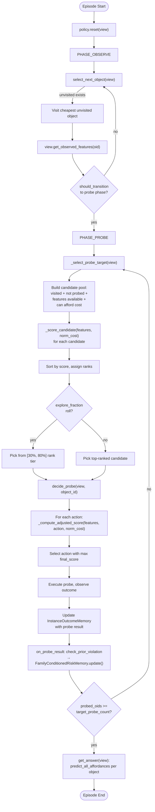
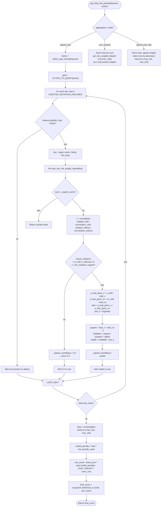
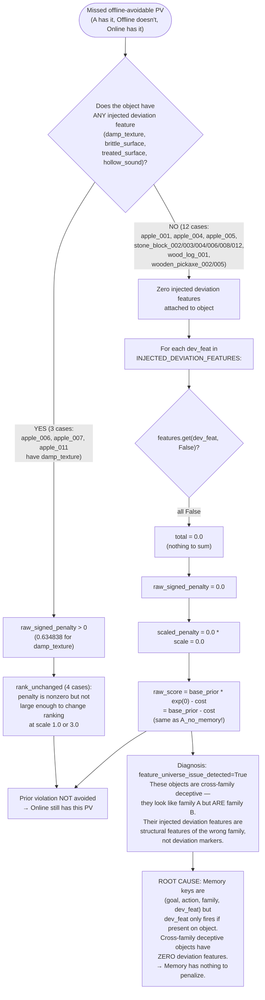
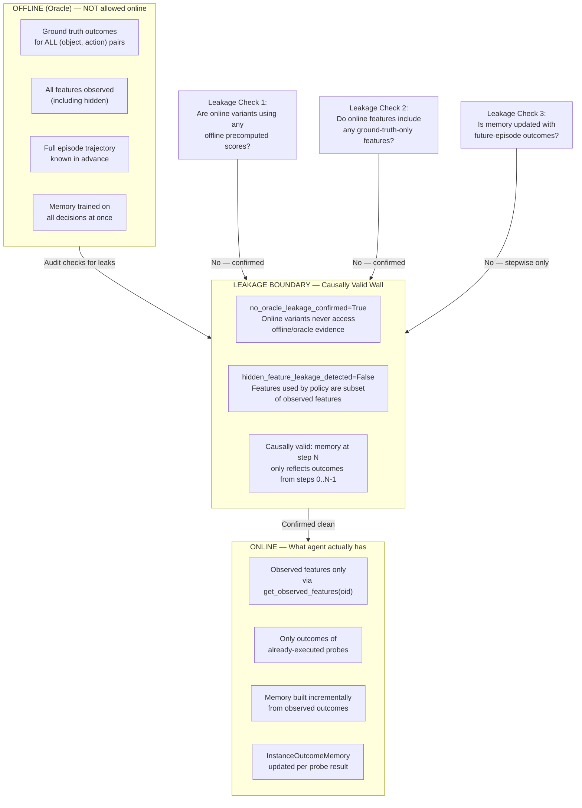
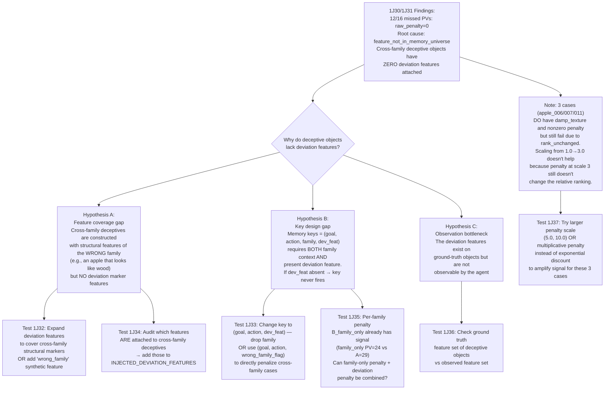

# Block 1J30 — Agent Decision Pipeline and Raw-Penalty Failure Flowcharts

Based on seed 109 decision-path audit and 1J31 raw-penalty-zero source audit.

---

## 1. Agent Decision Pipeline (Per-Episode Loop)

---

## 2. Raw Penalty Formation (Signed Sum)

Shows how `get_total_risk_penalty(features, action)` computes the final signed penalty used in score adjustment.

---

## 3. Seed109 Failure Path — Why raw_signed_penalty = 0 for 12/16 Missed PVs

Root cause from 1J31: `feature_not_in_memory_universe` — the 12 objects lack ALL injected deviation features.

---

## 4. Observation → Try-Action → Memory Update Loop

Shows how a single probe decision flows through observation, scoring, execution, and memory update.

```mermaid
flowchart TD
    START(["Agent at object oid"]) --> OBSERVE["features = view.get_observed_features(oid)"]
    OBSERVE --> OBSERVED_FEATS["Observed features include:<br/>- Type-family features (brownish, wood_grain...)<br/>- Deviation features IF present<br/>(damp_texture, brittle_surface, etc.)"]

    OBSERVED_FEATS --> SCORE_LOOP["For each action in MAIN_CANDIDATE_ACTIONS"]

    SCORE_LOOP --> COMPUTE_PRIOR["base_prior = get_goal_soft_prior(features, action)<br/>Uses detect_type_family → DEFAULT_GOAL_PRIOR[family, goal, action]"]
    COMPUTE_PRIOR --> COMPUTE_PENALTY["risk_penalty = get_total_risk_penalty(features, action)<br/>Only sums weights for deviation features<br/>PRESENT on the object"]

    COMPUTE_PENALTY --> CHECK_PENALTY{"risk_penalty == 0?"}
    CHECK_PENALTY --> |"yes (12/16 cases)"| NO_ADJUST["score = base_prior - COST_WEIGHT * norm_cost<br/>No risk adjustment at all"]
    CHECK_PENALTY --> |"no (3/38 candidates)"| ADJUST["scaled = risk_penalty * risk_penalty_scale<br/>raw_score = base_prior * exp(-scaled) - cost<br/>final_score = max(floor, raw_score)"]

    NO_ADJUST --> SELECT_ACTION
    ADJUST --> SELECT_ACTION["Select action with max final_score"]
    SELECT_ACTION --> EXECUTE["Execute probe: try the action"]

    EXECUTE --> OUTCOME["Observe real outcome (success/fail)<br/>from simulator ground truth"]

    OUTCOME --> CHECK_PV["check_prior_violation(features, action, outcome):<br/>is_eligible = soft_prior >= 0.60 AND<br/>is_violation = eligible AND outcome == fail"]

    CHECK_PV --> MEM_UPDATE["FamilyConditionedRiskMemory.update()"]
    MEM_UPDATE --> WHICH_MODE{"key_mode?"}
    WHICH_MODE --> |family_dev| UPDATE_DEV["For each dev_feat in INJECTED_DEVIATION_FEATURES:<br/>key = (goal, action, family, dev_feat)<br/>If dev_feat present on object: increment _with<br/>If dev_feat absent: increment _without"]
    WHICH_MODE --> |family_only| UPDATE_FAM["key_detected = (goal, action, family)<br/>Increment _with for detected family<br/>Increment _without for all other families"]

    UPDATE_DEV --> CLEAR_CACHE["Clear _risk_cache and _signed_cache<br/>(forces recomputation on next query)"]
    UPDATE_FAM --> CLEAR_CACHE

    CLEAR_CACHE --> LOG["Append to update_log:<br/>{episode_id, step_id, object_id,<br/>family, dev_feats_present,<br/>outcome, prior_violation, eligible}"]

    LOG --> NEXT_ACTION{"More probes<br/>in budget?"}
    NEXT_ACTION --> |yes| NEXT_OBJ["Move to next selected object"]
    NEXT_ACTION --> |no| END(["Probe phase complete"])
```

---

## 5. Leakage Boundary — What Separates Online from Offline

The audit confirms no hidden feature leakage and no oracle leakage. This diagram shows the boundaries.

---

## 6. Next-Test Decision Tree (Based on 1J30 + 1J31 Findings)

1J30 found `raw_penalty_zero` as dominant failure. 1J31 found `feature_not_in_memory_universe` as root cause: cross-family deceptive objects have NO injected deviation features.

---

## Summary of Key Numbers

| Metric | Value |
|--------|-------|
| Seed 109 | A PV=29, FamilyOnly=24, Offline=6 |
| Missed offline-avoidable PVs | 16 |
| Dominant failure (1J30) | raw_penalty_zero (12/16) |
| Root cause (1J31) | feature_not_in_memory_universe (12/12) |
| Candidates with nonzero raw signed | 3/38 |
| Rank unchanged cases | 4 (the 3 nonzero cases + stone_block_013) |
| Scale 1 vs Scale 3 probe set identical | True |
| Observation bottleneck | False |
| Memory support bottleneck | False |
| No oracle/hidden leakage | Confirmed |
